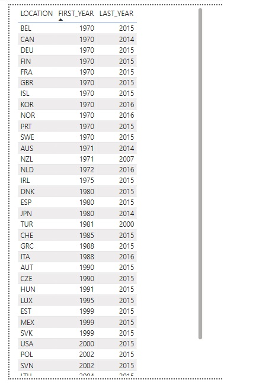
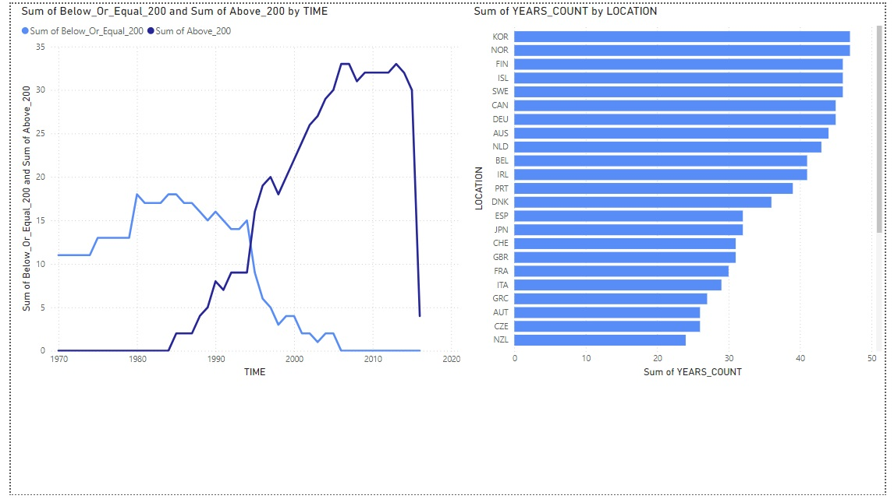

# Healthcare Spending Analysis
Comprehensive analysis of global healthcare spending trends, insights into country-specific contributions, and regional disparities using SQL and Power BI.

---

## Overview
This project examines healthcare spending patterns globally using historical data. Through SQL for data extraction and Power BI for data visualization, we reveal:
- Spending trends over time.
- Country-wise and per capita contributions to healthcare expenses.
- Regional variations and data completeness.

---

## Objectives
- Understand historical trends in healthcare spending above the average.
- Compare total and per capita healthcare expenditures across countries and regions.
- Highlight insights into data patterns and disparities using effective visualizations.

---

## Tools & Techniques
- **SQL**: For extracting and cleaning data.
- **Power BI**: For interactive dashboards and storytelling.
- **Datasets**: Historical healthcare spending data for multiple countries.

---

## Key Insights
1. **Global Trends**:
   - Significant growth in healthcare spending between 1970 and 2010.
   - A noticeable decline after 2010.
2. **Country Contributions**:
   - The USA accounts for the largest share of global healthcare spending (34%).
3. **Regional Disparities**:
   - Developed countries show high per capita spending, highlighting regional disparities.
4. **Data Completeness**:
   - Some countries have incomplete data, which poses challenges for long-term analysis.

---

## Project Files
- **SQL Queries**:
  - [`healthdataquerry.sql`](sql/healthdataquerry.sql): Extracts and transforms data for analysis.
- **Datasets**:
  - [CSV Files](data/): Includes cleaned and processed healthcare data.
- **Power BI Dashboards**:
  - [`Healthcare Spending Dashboard`](dashboards/Healthcare_Spending.pbix): Interactive dashboards for exploring the data.
- **Visualizations**:
  - [Screenshots Folder](visualizations/): Includes static images of key visualizations.

---

## Visualizations

### 1. **Line Chart**: Total Spending Above Average (1970–2015)
Illustrates the growth in healthcare spending above the average over the years.

### 2. **Pie Chart**: Country Contributions to Total Healthcare Spending
Shows the proportional contributions of countries to global healthcare expenses.

### 3. **Map Visualization**: Per Capita Healthcare Spending by Region
Highlights the geographic distribution of healthcare spending.

### 4. **Table**: Data Coverage by Country
Displays the first and last years of available healthcare spending data for each country.

### 5. **Bar and Line Charts**:
#### - Number of Reporting Countries Over Time
Tracks the growth in the number of countries contributing data.
#### - Average Spending Per Year
Highlights the average spending trends over the years.

---

## Interactive Dashboards
Explore the interactive Power BI dashboard for deeper insights:
- [Healthcare Spending Dashboard](#)

---

## How to Run
1. Clone the repository: `git clone https://github.com/AfshinBahrampour/Healthcare_Spending_Analysis.git`
2. Open the `.pbix` files in Power BI Desktop.
3. Run the SQL queries in any SQL environment.

## Contact
For questions or collaboration opportunities, feel free to reach out:
- **Email**: bahrampour_afshin@yahoo.com
- **LinkedIn**: [Your LinkedIn](https://www.linkedin.com/in/afshin-bahrampour/)
