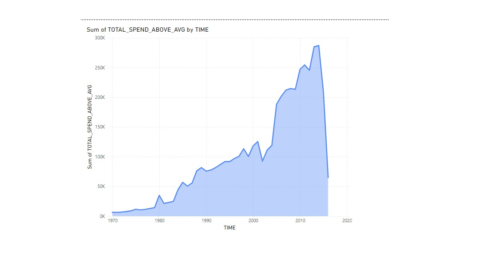
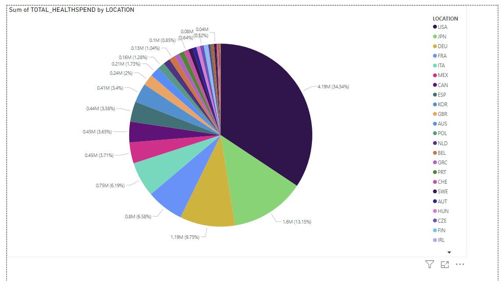
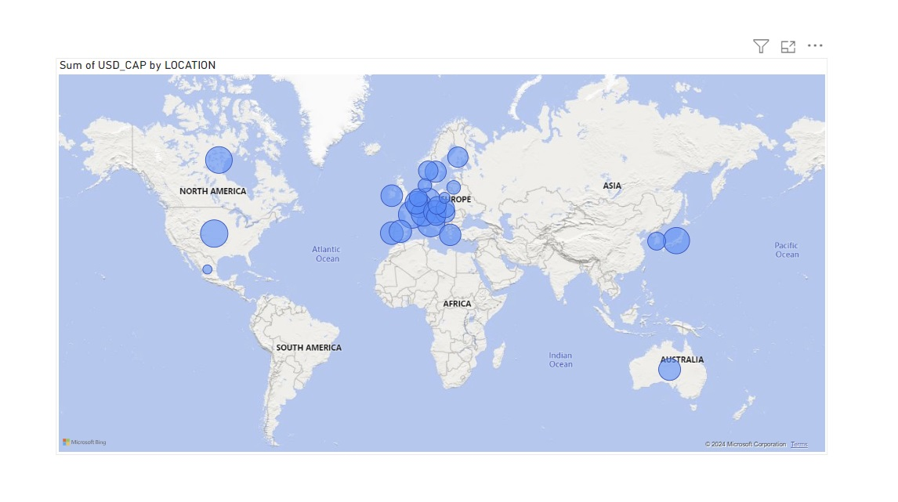

# Healthcare_Spending_Analysis
Analysis of healthcare spending trends and insights using SQL and Power BI.
# Healthcare Spending Analysis

## Overview
This project analyzes global healthcare spending trends, comparing country-specific expenditures and deriving actionable insights using SQL and Power BI.

## Objectives
- Analyze historical trends in healthcare spending above the average.
- Compare total and per capita healthcare expenditures across countries.
- Visualize data to highlight patterns and disparities.

## Tools & Techniques
- **SQL**: Data extraction and transformation.
- **Power BI**: Data visualization and storytelling.

## Project Files
- **SQL Queries**: [healthdataquerry.sql](sql/healthdataquerry.sql)
- **Datasets**: [CSV files](data/)
- **Power BI Dashboards**: [Healthcare Spending Dashboard](dashboards/)
- **Visualizations**: [Screenshots](visualizations/)

## Key Insights
1. **Global Trends**: Healthcare spending significantly increased between 1970 and 2010.
2. **Country Contributions**: The USA contributes over 34% of global healthcare expenditures.
3. **Regional Disparities**: High per capita spending is concentrated in developed regions.
4. **Data Coverage**: Some countries have incomplete data, requiring careful analysis.

## Visualizations
1. **Line Chart**: Total spending above average (1970-2015).
   
2. **Pie Chart**: Country contributions to total healthcare spending.
   
3. **Map**: Per capita healthcare spending by region.
   

## Interactive Dashboards
- Explore the interactive Power BI dashboard [here](#).

## Skills Demonstrated
- SQL for data extraction and cleaning.
- Power BI for creating dashboards and storytelling.
- Data visualization and trend analysis.

## How to Run
1. Clone the repository: `git clone https://github.com/AfshinBahrampour/Healthcare_Spending_Analysis.git`
2. Open the `.pbix` files in Power BI Desktop.
3. Run the SQL queries in any SQL environment.

## Contact
For questions or collaboration opportunities, feel free to reach out:
- **Email**: bahrampour_afshin@yahoo.com
- **LinkedIn**: [Your LinkedIn](https://www.linkedin.com/in/afshin-bahrampour/)
